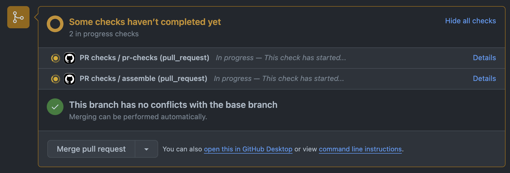
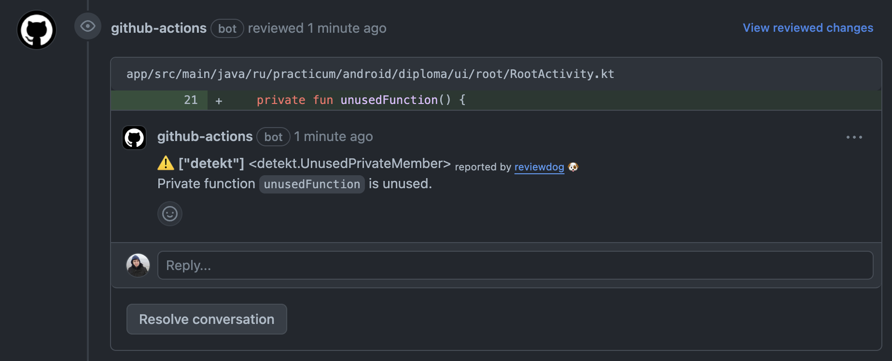
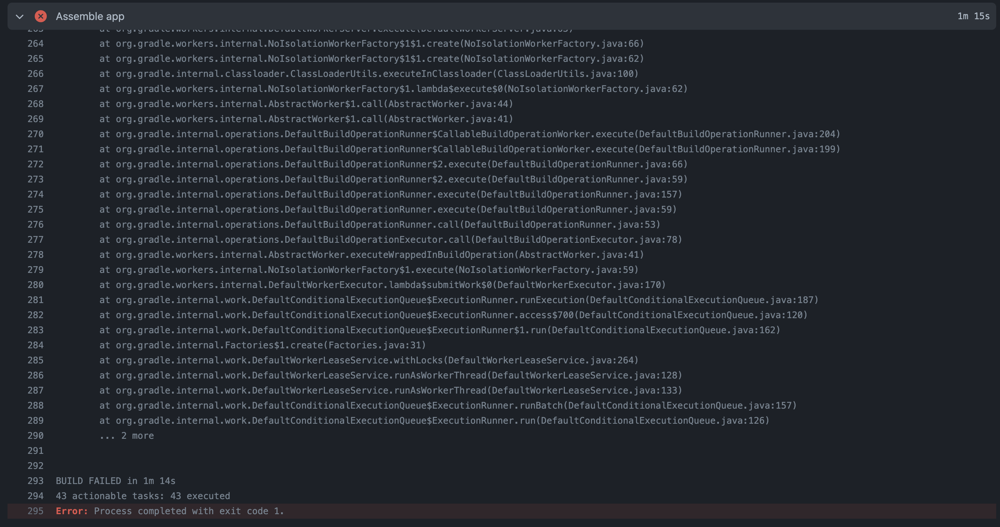
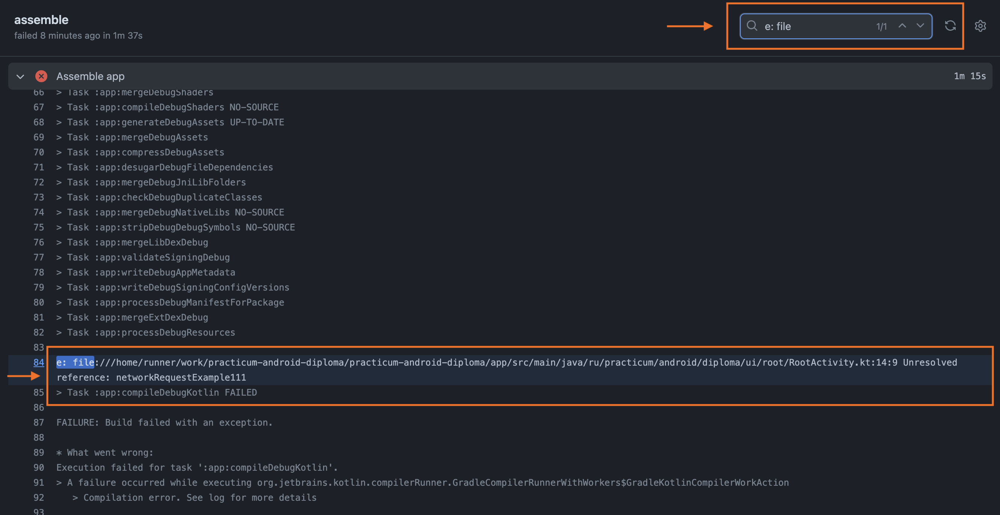
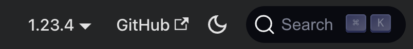
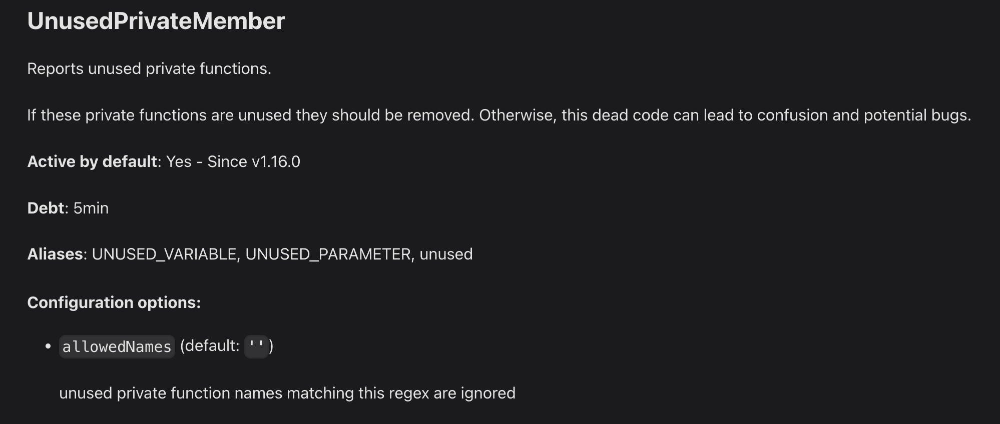
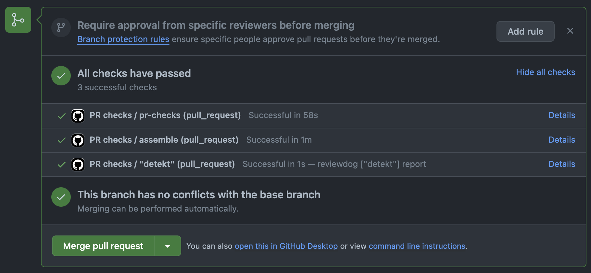

# Условия работы над дипломным приложением

Друзья, вы приступаете к финальному заданию на курсе. Поздравляем вас!

Чтобы ваш путь прошёл плавно и в рабочей обстановке, мы подготовили для вас подробное описание технического задания по проекту, условий работы над приложением и критериев успешного выполнения дипломного проекта.

## Количество человек в команде и объём задач

По техническому заданию создание приложения рассчитано на команду из **четырёх человек**.

Если в вашей команде только **три человека**, то реализация приложения предполагает упрощённый вариант. В частности, это касается настроек параметров фильтрации поисковых запросов.

Для команды из **четырёх** человек этот экран должен содержать полный набор настроек:

- Выбор места работы («Страна» и «Регион»).
- Выбор отрасли вакансии.
- Указание ожидаемого уровня заработной платы.
- Выбор возможности не отображать в результатах поиска вакансий, для которых не обозначен уровень заработной платы.

Для команды из **трёх** человек экран настроек параметров фильтрации должен предоставлять только следующие возможности:

- Выбор отрасли вакансии.
- Указание ожидаемого уровня заработной платы.
- Выбор возможности не отображать в результатах поиска вакансий, для которых не обозначен уровень заработной платы.

Команда из **трёх** человек может брать в работу полный набор возможностей экрана настроек фильтрации, но недочёты или неполная реализация выбора места работы не будут считаться критичными при сдаче всего дипломного проекта.

## Декомпозиция и сложность проекта

Для удобства мы разделили всё приложение на несколько ключевых частей (**эпиков**), некоторые из которых, в свою очередь, разделены на несколько под-задач. Так вам будет проще распределить работу над проектом внутри команды, а также контролировать прогресс завершённости всего приложения и его отдельных функциональных возможностей.

Большинство задач не потребуют от вас больше знаний и навыков, чем те, которые вы получили за время прохождения курса.
Тем не менее, для того, чтобы готовое приложение было предоставляло наиболее приятный опыт использования мы добавили несколько возможностей, для реализации которых вам предстоит немного проявить навыки самостоятельного исследования. Но не переживайте, именно для этих задач мы подготовили подсказки.

Подсказки для нетипичных задач развёрнутые и направляют к конкретным решениям, поэтому вы вполне можете с ними справиться. Если вы придёте к решению самостоятельно, то это уровень специалиста, достойный особого внимания работодателей.

Структура пакетов в шаблонном проекте предлагает наиболее популярный вариант группировки классов в чистой архитектуре.
Но вы можете изменить эту структуру, если, например, предпочитаете деление на архитектурные слои в рамках отдельных функциональных возможностей приложения.

Следующий урок представляет собой перечисление критериев успешного выполнения дипломного проекта. Мы рекомендуем вам **самостоятельно выполнить задание** и только после проверить себя по критериям успеха.

## Сдача очередной итерации ревьюверам

В прошлом уроке есть упоминание о том, что в шаблоне дипломного проекта настроен CI на основе [Github Actions](https://github.com/features/actions). На каждый созданный pull request CI-сервер:

- Скомпилирует проект и соберёт APK приложения, описанного в модуле `app`. Готовый APK можно скачивать на свой телефон или передавать на тестирование другим разработчикам или ревьюверам.
- И запустит [статический анализатор `detekt`](https://detekt.dev/), чтобы подсветить наличие или отсутствие ошибок, которые можно обнаружить, не запуская приложение. В частности, это поможет вам соблюдать принятый на проекте код-стайл.

Убедитесь в том, что перед сдачей очередной итерации разработки проекта ревьюверам, **вы исправили все ошибки, найденные в ходе сборки на CI-сервере**.

**ЭНДИ** А как понять, что есть ошибки?

Когда вы создаёте pull request, Github отобразит специальную плашку о процессе сборки приложения на CI:

Когда сборка на CI завершена, Github отобразит результаты этой сборки. Если pull request содержит ошибки, то в этом блоке вы обнаружите красные крестики возле стадий сборки:

На скриншоте видно, что есть ошибки в стадиях `assemble` (компиляция приложения) и `detekt` (запуск статического анализатора).

**ЭНДИ** А как понять, в чём заключается ошибка?

Сейчас расскажем!

### Поиск причин ошибок компиляции

В случае с ошибками компиляции проще всего запустить сборку приложения в Android Studio, и в логе сборки вы легко найдёте причины ошибок. Но можно посмотреть эти ошибки и на CI. Для этого нажмите на ссылку Details возле стадии сборки, это действие откроет лог компиляции приложения:

Можно полистать этот лог в поисках ошибок, а можно попробовать упростить себе задачу, отфильтровав лог в поисках строк, начинающихся с `e: file` — именно так начинаются строки, указывающие на причины ошибок компиляции:

На скриншоте видно, что причиной ошибки стало использование необъявленной функции `networkRequestExample111`.

### Поиск ошибок от статического анализатора detekt

В случае с ошибками `detekt` специальный бот добавит к вашему pull request комментарии к отдельным строкам, где он обнаружил ошибки:

В этих комментариях можно найти всю необходимую для исправления информацию: во-первых, вы увидите кусочек кода, который считается ошибочным, а во-вторых, в тексте комментария вы обнаружите название `detekt-правила`, которое отметило наличие ошибки и краткое пояснение, в чем же заключается ошибка. На скриншоте видно, что ошибка вызвана правилом `UnusedPrivateMember` и что она указывает на то, что приватная функция `unusedFunction` нигде не используется, а значит её можно смело удалить.

**ЭНДИ** Вот это полезно!

К сожалению, не все правила настолько очевидны, и иногда требуется заглянуть в документацию detekt, чтобы разобраться. К счастью, документация у detekt отличная, и в ней есть встроенный поиск.
Откройте [сайт с документацией](https://detekt.dev/), в правом верхнем углу вы найдёте поле поиска:

Нажмите на это поле и введите название правила, которое вызвало ошибку:

Ищите результаты, которые совпадают с названием вашего правила, и нажимайте на этот результат. После этого откроется подробная документация, где будет описано в чём заключается правило, в чём его мотивация и как его исправить:

**ЭНДИ** Удобно!

Когда вы исправите все ошибки, Github отобразит это: в нижнем блоке вы найдёте фразу All checks have passed. А если развернёте его, нажав на надпись Show all checks, то обнаружите зелёные галочки возле каждой стадии сборки:

