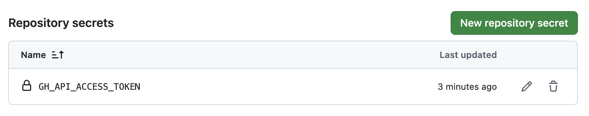
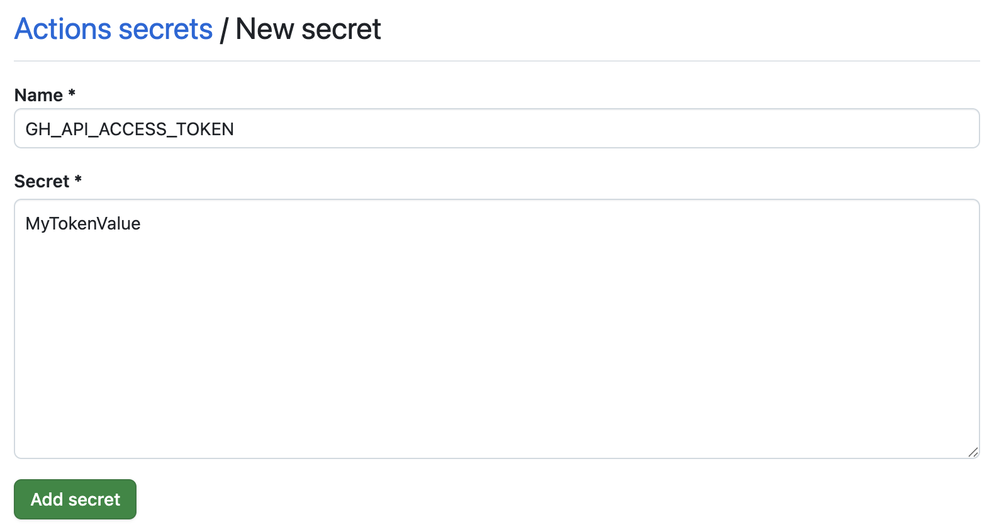

# Дипломный проект Яндекс.Практикума по курсу "Android-разработчик"

Проект представляет собой стартовую точку для разработки дипломного проекта Яндекс.Практикума по
курсу ["Android-разработчик"](https://practicum.yandex.ru/android-developer/).

# Предварительная настройка проекта

## Добавление секретного токена API для поиска вакансий

Для проброса секретного токена для использования API, сгенерированного на [специальной странице](https://practicum-diploma-8bc38133faba.herokuapp.com/login), создайте в корне проекта файл 
`develop.properties` и добавьте туда одно свойство:

```properties
apiAccessToken=my_access_token
```

Вместо `my_access_token` вставьте полученный после регистрации токен доступа к API для поиска вакансий. После изменения значения
синхронизируйте проект.

Файл `develop.properties` игнорируется при коммитах в Git, поэтому можно не бояться, что значение токена попадёт в
открытый доступ. Значения, записанные в файл `develop.properties`, будут добавлены в приложение на стадии сборки и
попадут в специальный объект, который называется `BuildConfig`. Подробнее про этот объект можно почитать
в [документации](https://developer.android.com/build/gradle-tips#share-custom-fields-and-resource-values-with-your-app-code).

## Статический анализ

В проекте настроен базовый статический анализатор - [detekt](https://detekt.dev/).
Он проверит наличие большого количества стандартных ошибок при написании Kotlin-кода.

Конфигурационный файл detekt находится [здесь](./conf/detekt.yml). Описание смысла правил можно найти
в официальной документации detekt - [например, вот правила группы `comments`](https://detekt.dev/docs/rules/comments).

Чтобы проверить наличие ошибок detekt в проекте, откройте терминал и выполните команду `./gradlew detektAll`. После
выполнения в выводе терминала вы увидите список ошибок, если они у вас есть, рядом с каждой ошибкой будет находиться
ссылка на кусочек кода, где detekt обнаружил ошибку.

Также в проекте настроена команда, которая исправляет большое количество ошибок форматирования detekt. Чтобы запустить
её, откройте терминал и выполните команду `./gradlew detektFormat`.

## Настройка Github Actions

В дипломном проекте используется сервис [Github Actions](https://github.com/features/actions) для настройки CI (
Continuous Integration). Это позволяет автоматизировать базовые проверки качества приложения, такие как компиляция
проекта и прогон статического анализатора [detekt](https://github.com/detekt/detekt). Файл конфигурации CI вы
можете [найти здесь](./.github/workflows/pr_checks.yml).

На каждый созданный pull request CI-сервер:

- Скомпилирует проект и соберёт APK приложения, описанного в модуле `app`. Готовый APK можно скачивать на свой телефон
  или передавать на тестирование другим разработчикам или ревьюверам.
- И запустит статический анализатор `detekt`, чтобы подсветить наличие или отсутствие ошибок, которые можно обнаружить,
  не запуская приложение. В частности, это поможет вам соблюдать принятый на проекте код-стайл.

Чтобы автоматические проверки могли запускаться на каждый созданный pull request, необходимо сделать несколько
дополнительных действий:

- Активировать `Github Actions` в вашем форке дипломного проекта.
- И добавить токен API для поиска вакансий в секреты репозитория.

### Шаг 1 - Активация Github Actions

По умолчанию Github отключает настроенные `Github Actions` для каждого форка оригинального репозитория. Это сделано для
того, чтобы каждый разработчик и разработчица осознанно применяли описанные конфигурации CI (мало ли что настроено в
оригинальном репозитории!).

Чтобы активировать `Github Actions` в форке дипломного проекта, необходимо зайти во вкладку `Actions`:



А затем нажать на зелёную кнопку - так вы даёте своё согласие на запуск описанных в репозитории
файлов-конфигураций `Github Actions`:


### Шаг 2 - Добавление токена API для поиска вакансий в секреты проекта

Файл `develop.properties` не хранится в истории коммитов, однако значение токена API для поиска вакансий необходимо для успешной
сборки APK приложения. Чтобы CI-сервер смог получить значение токена, его нужно добавить
в [секреты репозитория для Github Actions](https://docs.github.com/ru/actions/security-guides/using-secrets-in-github-actions#creating-secrets-for-a-repository).

Откройте вкладку `Settings` с главной страницы форка:


В левой части экрана найдите раздел `Security`, в нём есть пункт `Secrets and variables` (цифра (1) на скриншоте). При
нажатии на этот пункт появится выпадающий список, в котором будет элемент списка `Actions` (цифра (2) на скриншоте).


Нажмите на этот элемент списка и в правой части экрана вы увидите блок, который называется `Repository secrets`:


Нажмите на кнопку `New repository secret`. В появившемся окне в качестве названия секрета укажите `GH_API_ACCESS_TOKEN`,
а в качестве значения укажите тот же токен, что вы добавляли в файл `develop.properties`:



После ввода ключа и значения нажмите кнопку `Add secret`. Если вы всё сделали правильно, то вы должны увидеть
обновлённый блок `Repository secrets`:


